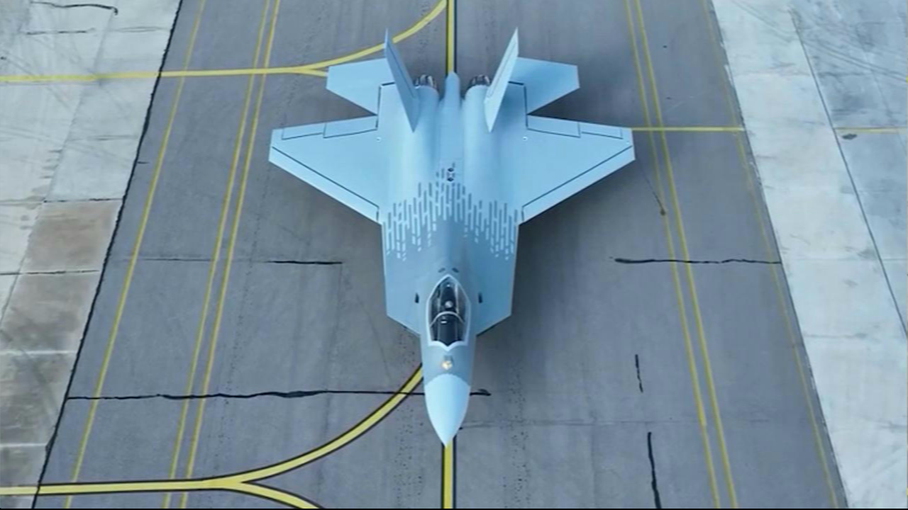
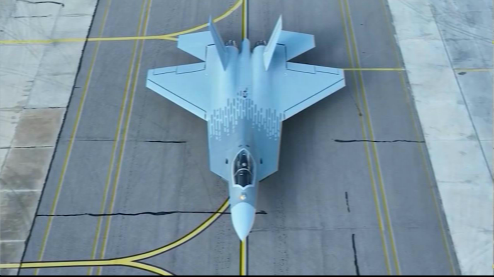
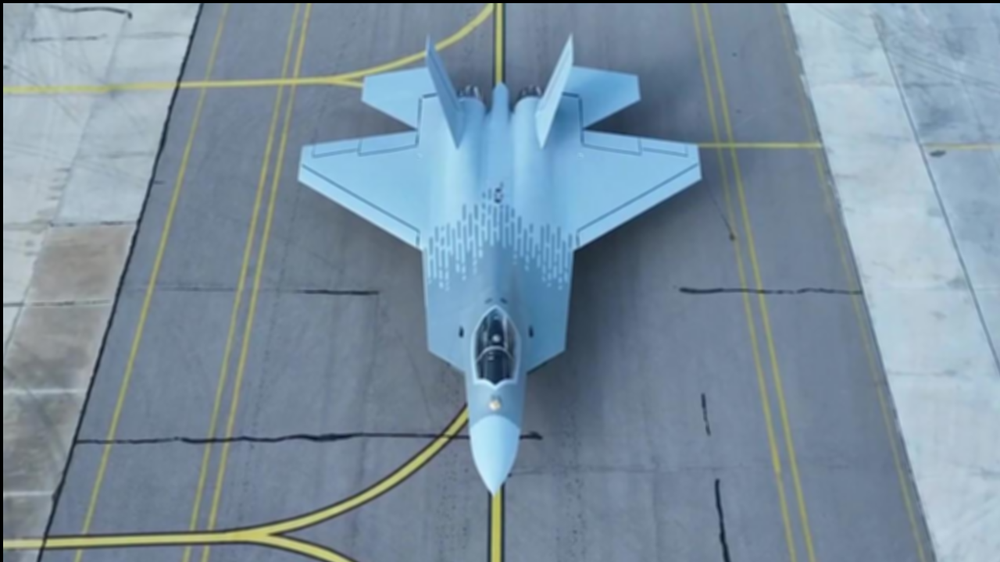
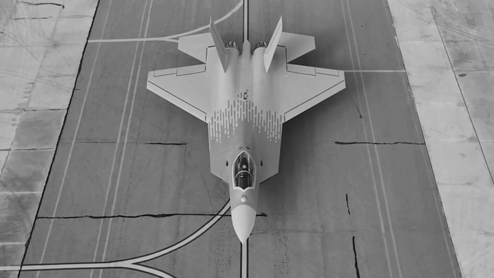
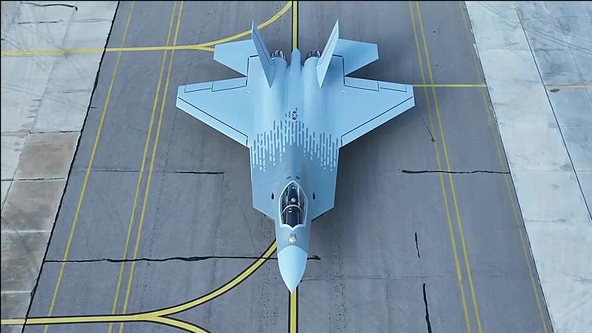
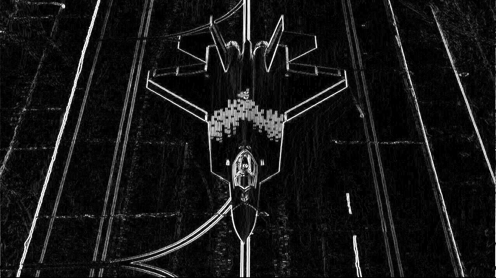
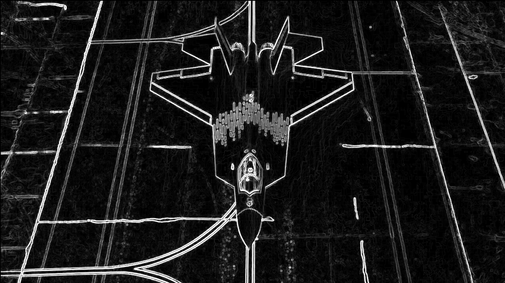
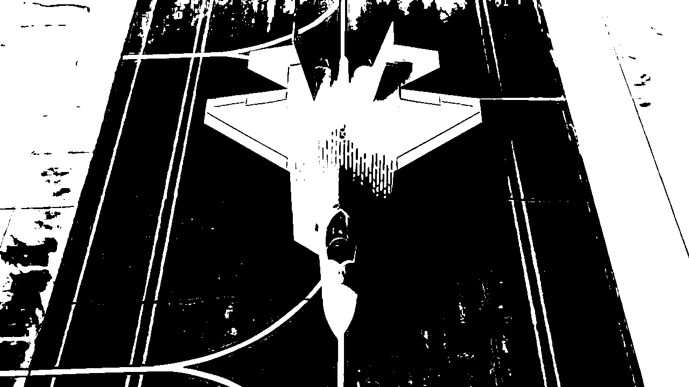
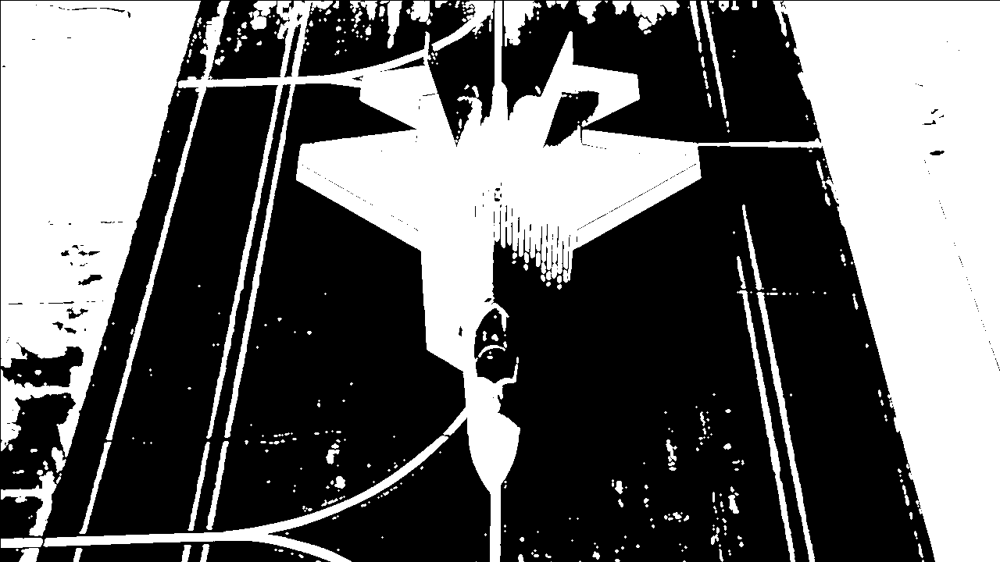
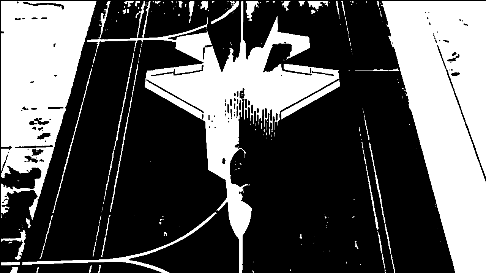

# RTL-Vision
FPGA-based image processing library targeting real-time and low-latency vision workloads.

### Kernel Comparison Table
<table>
	<thead>
		<tr>
			<th>Kernel</th>
			<th>Verilog Output</th>
			<th>CPU Output</th>
			<th>Verilog Time</th>
			<th>CPU Time</th>
		</tr>
	</thead>
	<tbody>
		<tr>
			<td><code>blur3x3_ycbcr</code></td>
			<td></td>
			<td></td>
			<td>9.19 ms</td>
			<td>29.339 ms </td>
		</tr>
		<tr>
			<td><code>blur5x5_ycbcr</code></td>
			<td></td>
			<td></td>
			<td>9.16 ms</td>
			<td>43.624 ms </td>
		</tr>
		<tr>
			<td><code>grayscale</code></td>
			<td></td>
			<td></td>
			<td>9.21 ms</td>
			<td>6.161 ms </td>
		</tr>
		<tr>
			<td><code>sharpen3x3_ycbcr</code></td>
			<td></td>
			<td></td>
			<td>9.19 ms</td>
			<td>7.556 ms </td>
		</tr>
		<tr>
			<td><code>sobel3x3</code></td>
			<td></td>
			<td></td>
			<td>9.19 ms</td>
			<td>16.664 ms </td>
		</tr>
		<tr>
			<td><code>threshold_128</code></td>
			<td></td>
			<td></td>
			<td>9.21 ms</td>
			<td>7.909 ms </td>
		</tr>
		<tr>
			<td><code>dilation3x3</code></td>
			<td></td>
			<td></td>
			<td>9.2 ms</td>
			<td>7.909 ms </td>
		</tr>
		<tr>
			<td><code>erosion3x3</code></td>
			<td></td>
			<td></td>
			<td>9.2 ms</td>
			<td>7.909 ms </td>
		</tr>
	</tbody>
</table>

## Kernel Set
The checked-in HDL sources currently cover these image-processing kernels and helpers:
 
### Morphological Operations
- ✅ Erosion (`erosion3x3`, `erosion5x5`)
- ✅ Dilation (`dilation3x3`, `dilation5x5`)

### Noise Reduction
- ✅ Salt Papper (`saltpapper`)
- ✅ Median filter (`median3x3`, `median5x5`)

### Edge and Feature Extraction
- ✅ Sobel: `sobel3x3`, `sobel5x5`
- ✅ Sharpen: `sharpen3x3_ycbcr`
- ✅ Blur: `blur3x3_ycbcr`, `blur5x5_ycbcr`
- ✅ Grayscale: `grayscale`
- ✅ Prewitt filter (`prewitt3x3`)
- ✅ Laplacian filter (`laplacian3x3`)
- ✅ Emboss filter (`emboss3x3`)

### Color Segmentation and Masking
- ✅ RGB_to_HSV
- ✅ RGB_to_YCBCR
- ✅ Inverse
- ✅ Inrage
- ✅ HSV range threshold (`hsv_inrange`)   

### Thresholding Improvements
- ✅ Threshold simple: `threshold`
- ✅ Adaptive / local thresholding (`adaptive_threshold`)

### Histogram and Contrast Operations
- ✅ Histogram generator (`histogram`)
- Contrast stretch (`contrast_stretch`)
- ✅ Histogram equalization (`histeq`)

### Pixel Arithmetic and Compositing
- ✅ Brightness adjustment (`brightness`)
- Contrast adjustment (`contrast`)
- ✅ Invert (`invert`)
- Gamma approximation / LUT-based gamma (`gamma_lut`)
- ✅ Multiply Accumulate (`mac`)
- ✅ Image or mask add/subtract operations

### Geometric Operations
- Crop ROI (`crop_roi`)
- Resize with nearest-neighbor (`resize_nn`)
- Horizontal flip (`flip_horizontal`)

### Advanced Vision Features
- Scharr filter
- Corner response approximation
- Non-maximum suppression
- Hough pre-processing blocks

### Binary Image Analysis
- Blob area counter
- Bounding box extractor
- Centroid estimator
  
## Sample Timing
The default frame budget is approximately `~9.2 ms`.

For the commonly cited `1024 x 768` reference case at `100 MHz`:

- Total pixels per frame: $1024 \times 768 = 786,432$
- Clock frequency: $100\,\text{MHz}$, so each cycle is $10\,\text{ns}$
- Total active pixel time: $786,432 \times 10\,\text{ns} \approx 7.86\,\text{ms}$

For the same `1024 x 768` frame at `5.4 GHz`:

- Clock frequency: $5.4\,\text{GHz}$, so each cycle is $\frac{1}{5.4}\,\text{ns} \approx 0.185\,\text{ns}$
- Total active pixel time: $786,432 \times 0.185\,\text{ns} \approx 145,636\,\text{ns} \approx 0.146\,\text{ms}$

The difference between the idealized active-pixel time of $7.86\,\text{ms}$ and the rough end-to-end frame budget of `~9.2 ms` comes from blanking intervals plus pipeline and control overhead. The sample `kaan` image artifacts committed in this repository are `1280 x 720`; the math above is the default latency estimate requested for the `1024 x 768` case.

## CPU Comparison Flow
`cpu_compare.py` reads `kaan.bmp` or `kaan.png` as the software input image. It does not generate any Verilog-side assets. It executes the CPU-streaming equivalents of the kernels and writes `cpu_*` output images.

The processing path now follows a streaming model instead of applying full-frame image filters:

- pixels are consumed in raster order
- grayscale and threshold run row by row
- `3x3` and `5x5` kernels keep only the active line buffers needed for the current window
- outputs become valid only after the trailing window is filled, so the leading border remains zeroed just like a streaming pipeline

The input still comes from an image file for repeatability, but the kernel execution itself is modeled as if pixels were arriving from a camera stream.

Running the script:

```bash
python3 -m pip install -r requirements.txt
python3 cpu_compare.py
python3 cpu_compare.py --input kaan.png
```

Generates:

- `cpu_kaan_*.png` as CPU-streaming reference outputs

Dependencies are captured in `requirements.txt`.

The timings below come from one local run of `python3 cpu_compare.py` inside the project `.venv`. This run uses the default streaming benchmark settings: `--warmup-runs 0 --benchmark-runs 1 --sample-iterations 1`. Image write-out is not included in the reported time. For comparison, the RTL pipeline is listed as `9.2 ms` per frame.

 